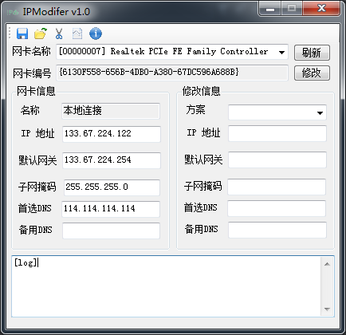
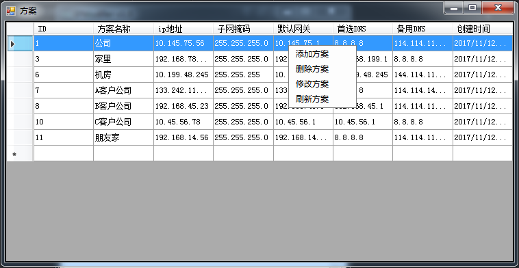

# IPModifer
快速切换公司，家里，机房，客户公司等等ip设置

在渗透测试工作中，经常会在不同的客户公司进行内网渗透，反复修改ip设置。觉得甚是麻烦。写个GUI程序，斩断这烦恼丝！

#### 项目结构
```
|---clean.bat 清除垃圾批处理
|---IPModifer.sln 工程文件
|---IPModifer 代码文件夹
|---doc 文档
|    |--- main.png 主界面
|    |--- configmannager.png 配置方案管理界面
|    |--- IPModifer.mdl Rational rose文件
|
|---bin 编译好的项目
|    |---config.mdb 数据库
|    |---IPModifer.exe 主程序
```
#### 主界面


#### 配置方案界面
